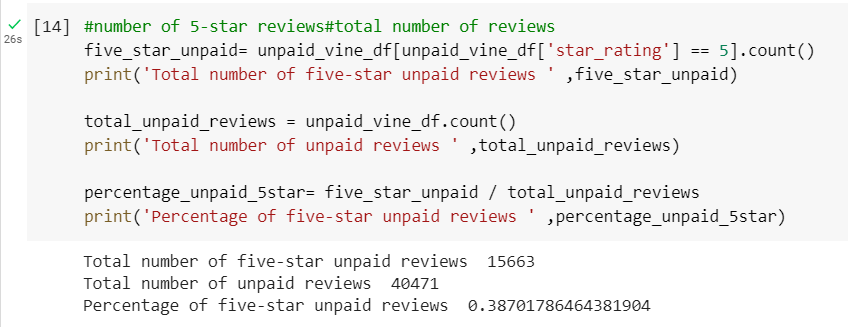
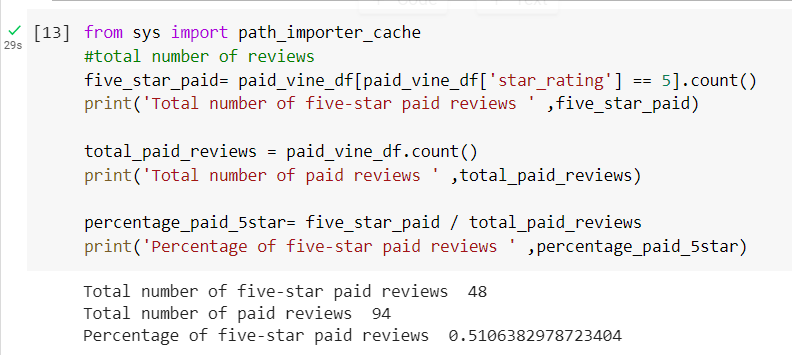

# Amazon_Vine_Analysis
Big Data

## Overview of the Analysis
### Purpose

The purpose of this analysis is to compare reviews of video games by unpaid product reviews and reviews written by members of Amazon's Vine Program, to see if there is a positivity bias by members who get paid to write reviews. The Vine Program is a service that companies can use by paying a fee to Amazon and providing products to Vine members, which then are required to write a product review. Using PySpark, the ETL process was followed to extract and transform video game review data from Amazon. The transformed data was then loaded into PgAdmin by connecting to a Relational Database Service in Amazon Web Services.  Comparing vine reviews with regular customer reviews to if there could be bias will help our customer, SellBy, to decide whether joining the Vine program would be beneficial or not. 

### Resources
* PgAdmin     
* Collab
* RDS in AWS     
* PySpark
* Video Game Reviews taken from (https://s3.amazonaws.com/amazon-reviews-pds/tsv/index.txt)
## Results

### Unpaid Product Reviews Overview 

15,663 out of 40,471 unpaid customer reviews received five stars. This means 38.7% of customer reviews gave the video game a five-star rating.

### Paid Vine Member Reviews Overview

48 out of 94 unpaid customer reviews received five stars. This means 51.1% of customer reviews gave the video game a five-star rating.

## Summary

Looking at Video Games reviews from both Amazon Vine Program members and regular Amazon customers, the percentages of five-star reviews from each group of reviewers were calculated to see if paid reviews were more positively biased. 

40,471 reviews from regular Amazon customers were examined. From the customer reviews, 15,663 were given five stars, meaning that 38.7 percent received five stars.

On the other hand, there were 94 paid video game reviews from Amazon's Vine Program. Of these reviews, 48 received five-star ratings. This means that 51.1 percent of the reviews written by Vine Program members gave their video game five stars.

By just comparing the percentages of five-star reviews given from customers versus Vine members, it does seem to suggest that Vine members give video games five stars in their reviews. Vine members gave about 13 percent more five-star ratings than regular customers. This could be considered bias, as Vine Program members get paid to review products they are sent. Only having a 13 percent increase in five-star ratings may not be enough to justify joining the Vine program. Another thing to note is the significant disparity between the data sample sizes of each reviewer type. Only 94 reviews out of 40,565 total reviews were made by Vine members. This makes up less than one percent of the reviews. As a company looking to get positive reviews by buying into the Amazon Vine Program, it does not seem like the program has enough reviewers to make a significant difference. 
It could be beneficial to compare four-star reviews between the two groups of reviews. Also, finding and analyzing a data set that has a higher percentage of vine member reviews compared to customer reviews would be helpful.
